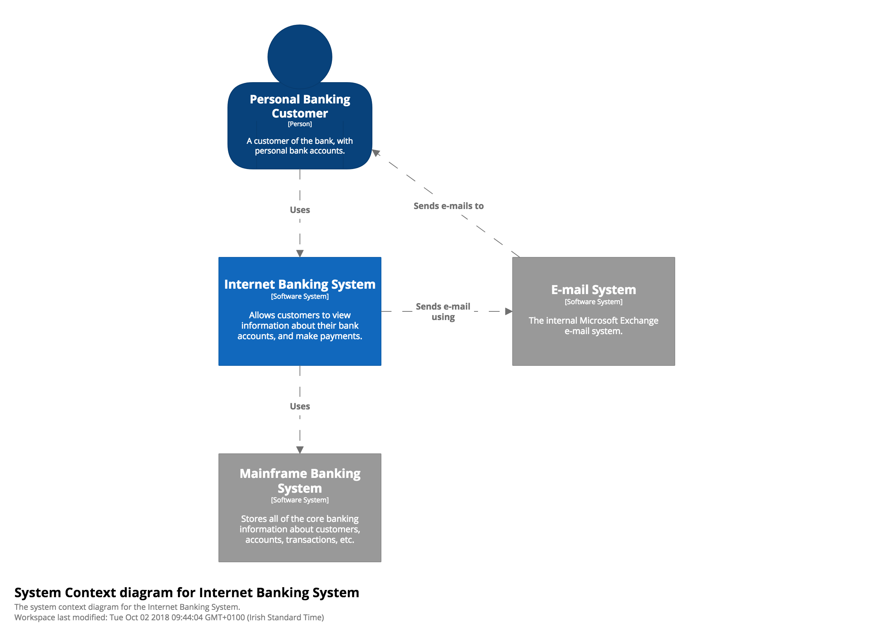
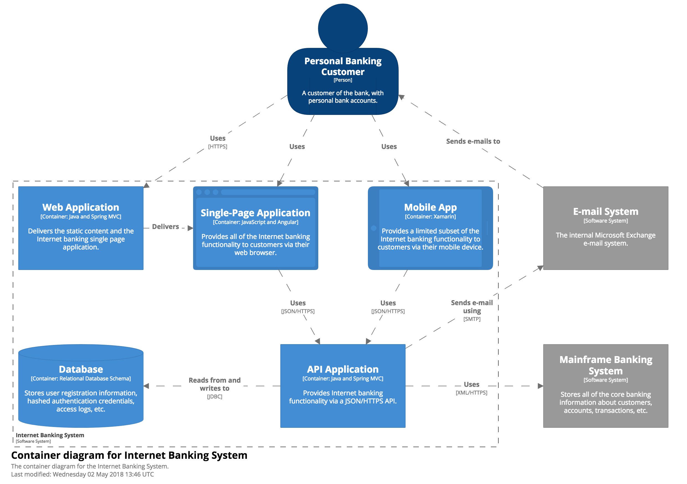
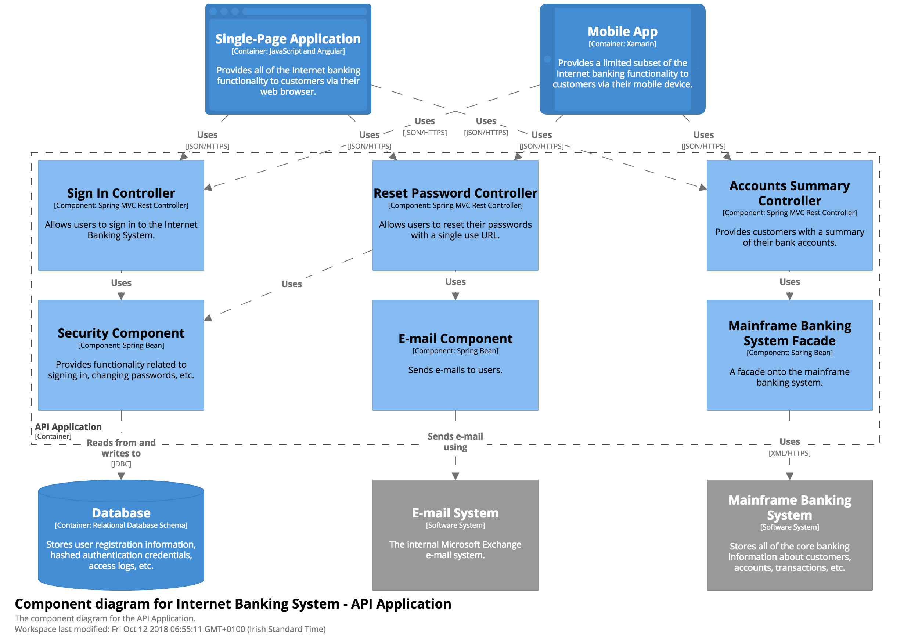
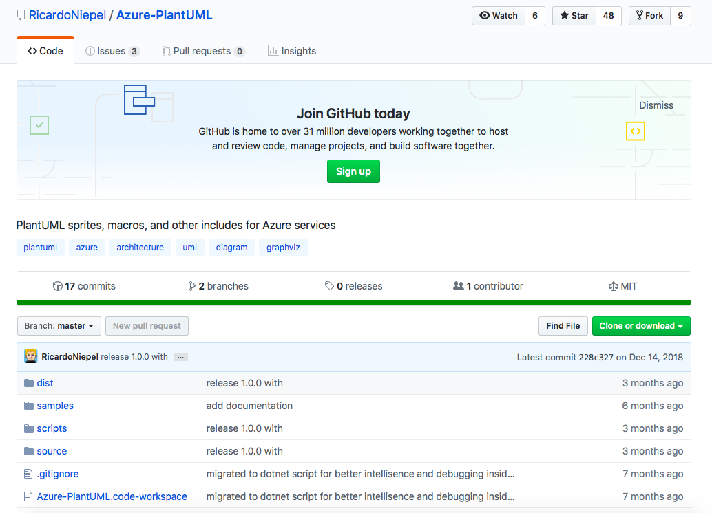

# Using Azure-PlantUML for better diagrams

## The State of Cloud Solution Architecture
### The State of Cloud Solution Architecture
  
  > "If someone wants to communicate or to discuss a Cloud Solution Architecture these days, you will not 
  > get a lot of implementation details."
  > 
  > "You’ll likely get a .red[confused mess of nice symbols, boxes and lines]. Including inconsistent notations with 
  > colours, shapes, line styles, ambiguous naming, unlabelled relationships, .red[generic terminology].
       
  > -- <cite>Ricardo Niepel</cite>
  <br>
  > <cite>https://azure-development.com/2018/09/11/save-the-world-from-powerpoint-cloud-solution-architects/</cite>
  
### Essentially, getting us from here ...


[Improve scalability in an Azure web application
](https://docs.microsoft.com/en-us/azure/architecture/reference-architectures/app-service-web-app/scalable-web-app)

### to here


### using this
```    
@startuml

!includeurl https://raw.githubusercontent.com/RicardoNiepel/C4-PlantUML/master/C4_Container.puml
    
!define AzurePuml https://raw.githubusercontent.com/RicardoNiepel/Azure-PlantUML/master/dist
!includeurl AzurePuml/AzureCommon.puml
!includeurl AzurePuml/Web/AzureCDN.puml
!includeurl AzurePuml/Web/AzureSearch.puml
!includeurl AzurePuml/Storage/AzureBlobStorage.puml
        
Person(user, "User")
    
Container(spa, "Single-Page App", "Angular, JS")
AzureWebApp(webApp, "Web & API App", "ASP.NET Core MVC 2.1, C#", "Delivers the SPA and provides RESTful web APIs which are consumed from the SPA")
AzureCDN(cdn, "CDN", "Akamai S2", "caches publicly available content for lower latency and faster delivery of content")
AzureBlobStorage(staticBlobStorage, "Static Content", "General Purpose v2, Hot, LRS")
AzureQueueStorage(queue, "Queue", "General Purpose v2, LRS")

Rel(user, spa, "Uses", "HTTPS")
Rel(user, webApp, "Uses", "HTTPS")
Rel(user, cdn, "Uses", "HTTPS")

@enduml
```
## C4: What is it?
### Introducing the C4 model for software architecture

C4 = Context, Containers, Components and Code

In a nutshell:

  > "The C4 model is an "abstraction-first" approach to diagramming software architecture, based upon abstractions 
  > that reflect how software architects and developers think about and build software.""
  <br>
  > <cite>https://c4model.com</cite>

  To illustrate, let's see an example:

### Context


### Container


### Components


### Code


## Enter Azure-PlantUML


[Ricardo Niepel's Azure-PlantUML](https://github.com/RicardoNiepel/Azure-PlantUML)

### Available Azure symbols 
  

  [Click here for the full list of available symbols](https://github.com/RicardoNiepel/Azure-PlantUML/blob/master/AzureSymbols.md#azure-symbols)

## Getting started

The tools:

  1. VS Code with the PlantUML extension
    
  1. [Graphviz](https://graphviz.gitlab.io)
  1. Copy one of the examples from: https://github.com/RicardoNiepel/Azure-PlantUML


### Hello World - Azure Functions
1. Create a `.puml` file and add the following:
    ```
    @startuml
        
    !includeurl https://raw.githubusercontent.com/RicardoNiepel/C4-PlantUML/master/C4_Container.puml
        
    !define AzurePuml https://raw.githubusercontent.com/RicardoNiepel/Azure-PlantUML/master/dist
    !includeurl AzurePuml/AzureCommon.puml
        
    !includeurl AzurePuml/Compute/AzureFunction.puml
    !includeurl AzurePuml/Web/AzureAPIManagement.puml
    !includeurl AzurePuml/Databases/AzureSqlDatabase.puml
        
    LAYOUT_TOP_DOWN
    LAYOUT_WITH_LEGEND
              
    Person(user, "User")
    ' Azure services
    AzureFunction(function, "Azure Function", "python", "Queries the Azure SQL DB")
    AzureAPIManagement(apimgmt, "Azure API Management", "acts as as a gatekeeper")
    AzureSqlDatabase(sqlDb, "SQL DB", "Standard S3")
        
    ' relationships      
    Rel(user,apimgmt, "Routes traffic based on geolocation")
    Rel(apimgmt,function, "Reads from", "HTTP")      
    Rel(function, sqlDb, "Reads from", "SQL query")
    @enduml
    ```

1. Preview the current diagram
  

1. Final result
  

---
## Thanks [Ricardo Niepel](https://github.com/RicardoNiepel) for a fantastic work and for raising the bar !
